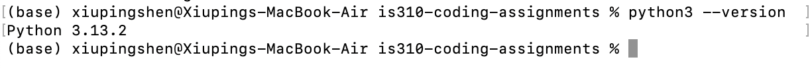

# Init IS310 Homework

## Proof of Installation

1. Python

2. Git

3. VS Code

4. AI Tool/Workflow 

<<<<<<< HEAD
How will you work with AI? What tools if any do you plan to use?
=======
How will you work with AI? What tools if any do you plan to use?
I will most likely only be using ChatGPT. I plan to work with AI by using it to explain assignments to me, to simplify the directions so I know what the deliverables are. 
>>>>>>> 1a64443d1341be2b0f1d2bf6573e8d1a94a2a0bc
