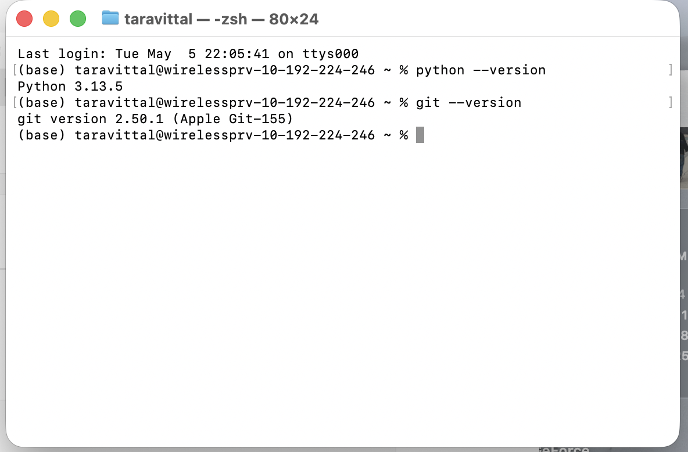
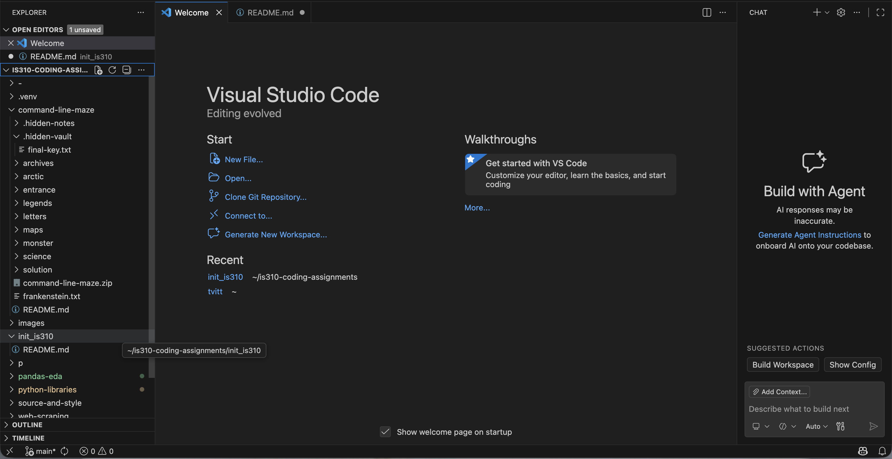

# Init IS310 Homework

## Proof of Installation

1. Python

2. Git

3. VS Code

4. AI Tool/Workflow 
How will you work with AI? What tools if any do you plan to use?
I will most likely only be using ChatGPT. I plan to work with AI by using it to explain assignments to me, to simplify the directions so I know what the deliverables are. 

Hypothesis username: taravittal

